# CHAT_FULL — Combined Sprint Diagrams

Auto-generated by `bobp chat-report --combine`. Do not edit by hand — regenerate after archiving a new sprint.

---

# CHAT_SPRINT_1 — Sprint Archive

## Summary

Sprint 1, Move and Rename (Tier 2, 5 pts, 0 fix cycles). Stage 0 (Tank): fingerprint-sampler imported from fingerling with history via subtree split; root build env, Makefile, uv.lock, hooks, manual CI, docs/SDLC.md. SKT-01: distribution sketch-tastic, import sketchtastic, commands sketchtastic and skt. SKT-02: the set is a sketch, one fingerprint a skit (Sketch, Skit, --sketch, skits:). No release (mainline).

---

## Planning

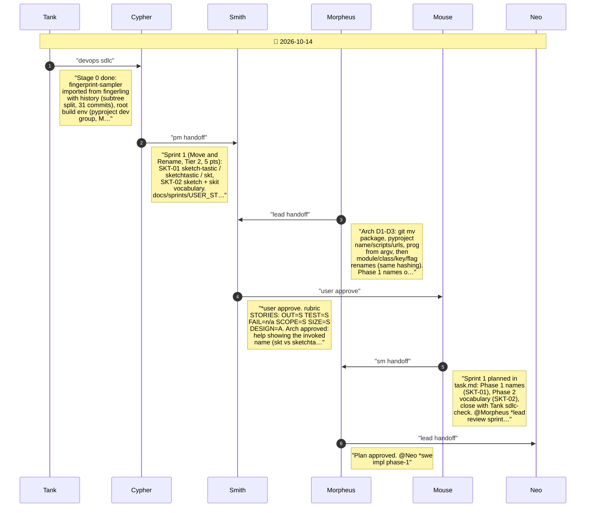
```mermaid
%%{init: {"sequence": {"messageFontSize": 14, "noteFontSize": 18, "actorFontSize": 14}}}%%
sequenceDiagram
    autonumber
    participant Tank
    participant Cypher
    participant Smith
    participant Morpheus
    participant Mouse
    participant Neo
    Note over Tank,Neo: 📅 2026-10-14
    Tank->>Cypher: "devops sdlc"
    Note right of Tank: "Stage 0 done:<br/>fingerprint-sampler<br/>imported from fingerling<br/>with history (subtree<br/>split, 31 commits), root<br/>build env (pyproject dev<br/>group, M…"
    Cypher->>Smith: "pm handoff"
    Note right of Cypher: "Sprint 1 (Move and<br/>Rename, Tier 2, 5 pts):<br/>SKT-01 sketch-tastic /<br/>sketchtastic / skt,<br/>SKT-02 sketch + skit<br/>vocabulary.<br/>docs/sprints/USER_ST…"
    Morpheus->>Smith: "lead handoff"
    Note right of Morpheus: "Arch D1-D3: git mv<br/>package, pyproject<br/>name/scripts/urls, prog<br/>from argv, then<br/>module/class/key/flag<br/>renames (same hashing).<br/>Phase 1 names o…"
    Smith->>Mouse: "user approve"
    Note right of Smith: "*user approve. rubric<br/>STORIES: OUT=S TEST=S<br/>FAIL=n/a SCOPE=S SIZE=S<br/>DESIGN=A. Arch approved:<br/>help showing the invoked<br/>name (skt vs sketchta…"
    Mouse->>Morpheus: "sm handoff"
    Note right of Mouse: "Sprint 1 planned in<br/>task.md: Phase 1 names<br/>(SKT-01), Phase 2<br/>vocabulary (SKT-02),<br/>close with Tank sdlc-<br/>check. @Morpheus *lead<br/>review sprint…"
    Morpheus->>Neo: "lead handoff"
    Note right of Morpheus: "Plan approved. @Neo *swe<br/>impl phase-1"
```

---

## Phase 1

Phase 1: new names - sketch-tastic, sketchtastic, skt (SKT-01)

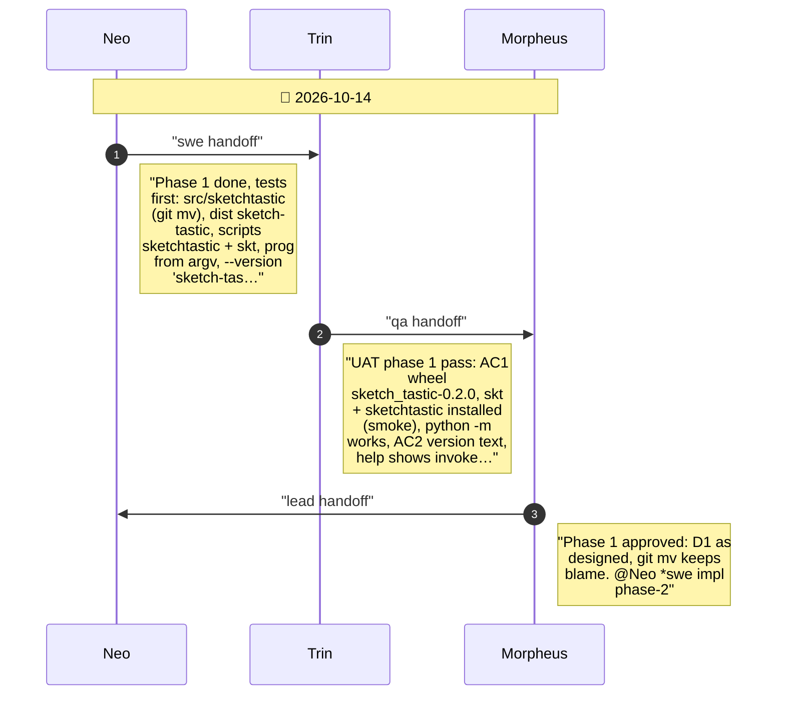
```mermaid
%%{init: {"sequence": {"messageFontSize": 14, "noteFontSize": 18, "actorFontSize": 14}}}%%
sequenceDiagram
    autonumber
    participant Neo
    participant Trin
    participant Morpheus
    Note over Neo,Morpheus: 📅 2026-10-14
    Neo->>Trin: "swe handoff"
    Note right of Neo: "Phase 1 done, tests<br/>first: src/sketchtastic<br/>(git mv), dist sketch-<br/>tastic, scripts<br/>sketchtastic + skt, prog<br/>from argv, --version<br/>'sketch-tas…"
    Trin->>Morpheus: "qa handoff"
    Note right of Trin: "UAT phase 1 pass: AC1<br/>wheel<br/>sketch_tastic-0.2.0, skt<br/>+ sketchtastic installed<br/>(smoke), python -m<br/>works, AC2 version text,<br/>help shows invoke…"
    Morpheus->>Neo: "lead handoff"
    Note right of Morpheus: "Phase 1 approved: D1 as<br/>designed, git mv keeps<br/>blame. @Neo *swe impl<br/>phase-2"
```

---

## Phase 2

Phase 2: sketch and skit vocabulary (SKT-02)

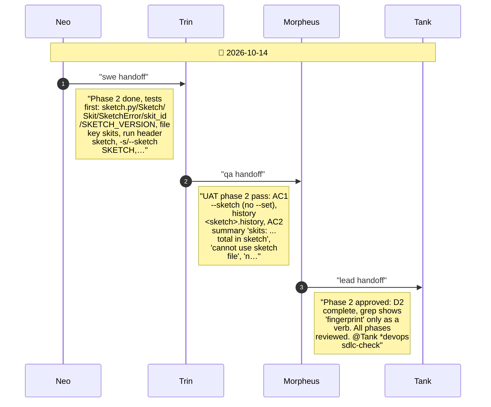
```mermaid
%%{init: {"sequence": {"messageFontSize": 14, "noteFontSize": 18, "actorFontSize": 14}}}%%
sequenceDiagram
    autonumber
    participant Neo
    participant Trin
    participant Morpheus
    participant Tank
    Note over Neo,Tank: 📅 2026-10-14
    Neo->>Trin: "swe handoff"
    Note right of Neo: "Phase 2 done, tests<br/>first: sketch.py/Sketch/<br/>Skit/SketchError/skit_id<br/>/SKETCH_VERSION, file<br/>key skits, run header<br/>sketch, -s/--sketch<br/>SKETCH,…"
    Trin->>Morpheus: "qa handoff"
    Note right of Trin: "UAT phase 2 pass: AC1<br/>--sketch (no --set),<br/>history<br/><sketch>.history, AC2<br/>summary 'skits: ...<br/>total in sketch',<br/>'cannot use sketch<br/>file', 'n…"
    Morpheus->>Tank: "lead handoff"
    Note right of Morpheus: "Phase 2 approved: D2<br/>complete, grep shows<br/>'fingerprint' only as a<br/>verb. All phases<br/>reviewed. @Tank *devops<br/>sdlc-check"
```

---

## Close

Close: Tank SDLC check, Oracle groom, Smith user test, retro, launch

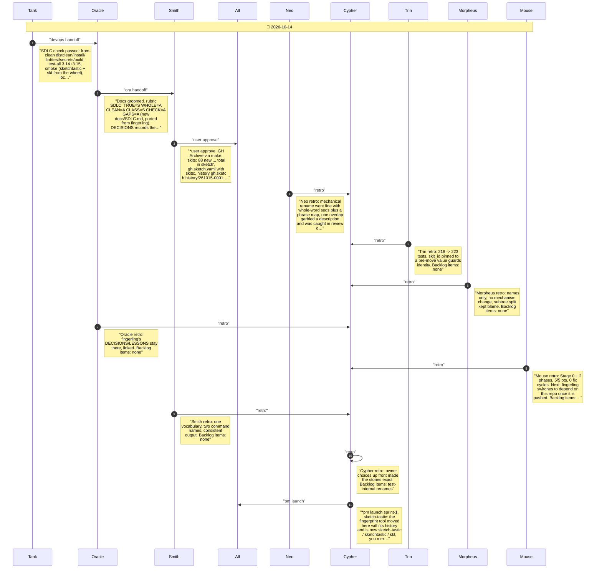
```mermaid
%%{init: {"sequence": {"messageFontSize": 14, "noteFontSize": 18, "actorFontSize": 14}}}%%
sequenceDiagram
    autonumber
    participant Tank
    participant Oracle
    participant Smith
    participant All
    participant Neo
    participant Cypher
    participant Trin
    participant Morpheus
    participant Mouse
    Note over Tank,Mouse: 📅 2026-10-14
    Tank->>Oracle: "devops handoff"
    Note right of Tank: "SDLC check passed: from-<br/>clean distclean/install/<br/>lint/test/secrets/build,<br/>test-all 3.14+3.15,<br/>smoke (sketchtastic +<br/>skt from the wheel),<br/>loc…"
    Oracle->>Smith: "ora handoff"
    Note right of Oracle: "Docs groomed. rubric<br/>SDLC: TRUE=S WHOLE=A<br/>CLEAN=A CLASS=S CHECK=A<br/>GAPS=A (new<br/>docs/SDLC.md, ported<br/>from fingerling).<br/>DECISIONS records the…"
    Smith->>All: "user approve"
    Note right of Smith: "*user approve. GH<br/>Archive via make:<br/>'skits: 88 new ... total<br/>in sketch',<br/>gh.sketch.yaml with<br/>skits:, history gh.sketc<br/>h.history/261015-0001.…"
    Neo->>Cypher: "retro"
    Note right of Neo: "Neo retro: mechanical<br/>rename went fine with<br/>whole-word seds plus a<br/>phrase map, one overlap<br/>garbled a description<br/>and was caught in review<br/>o…"
    Trin->>Cypher: "retro"
    Note right of Trin: "Trin retro: 218 -> 223<br/>tests, skit_id pinned to<br/>a pre-move value guards<br/>identity. Backlog items:<br/>none"
    Morpheus->>Cypher: "retro"
    Note right of Morpheus: "Morpheus retro: names<br/>only, no mechanism<br/>change, subtree split<br/>kept blame. Backlog<br/>items: none"
    Oracle->>Cypher: "retro"
    Note right of Oracle: "Oracle retro:<br/>fingerling's<br/>DECISIONS/LESSONS stay<br/>there, linked. Backlog<br/>items: none"
    Mouse->>Cypher: "retro"
    Note right of Mouse: "Mouse retro: Stage 0 + 2<br/>phases, 5/5 pts, 0 fix<br/>cycles. Next: fingerling<br/>switches to depend on<br/>this repo once it is<br/>pushed. Backlog items:…"
    Smith->>Cypher: "retro"
    Note right of Smith: "Smith retro: one<br/>vocabulary, two command<br/>names, consistent<br/>output. Backlog items:<br/>none"
    Cypher->>Cypher: "retro"
    Note right of Cypher: "Cypher retro: owner<br/>choices up front made<br/>the stories exact.<br/>Backlog items: test-<br/>internal renames"
    Cypher->>All: "pm launch"
    Note right of Cypher: "*pm launch sprint-1.<br/>sketch-tastic: the<br/>fingerprint tool moved<br/>here with its history<br/>and is now sketch-tastic<br/>/ sketchtastic / skt,<br/>you mer…"
```

---

# CHAT_SPRINT_2 — Sprint Archive

## Summary

Sprint 2, Sort the Show (Tier 2, 2 pts, 0 fix cycles). Owner: sort lowest first only, KEY = header any case, default COUNT (flips most-frequent-first), --top N dropped. Phase 1 refactored show columns to (header, value, cell) data, output unchanged. Phase 2 added show --sort KEY: '-' first, numbers before text, ties in file order, unknown/ambiguous key exits 2 listing columns; help and README. GH Archive: | tail shows heaviest skit. No release (mainline).

---

## Planning

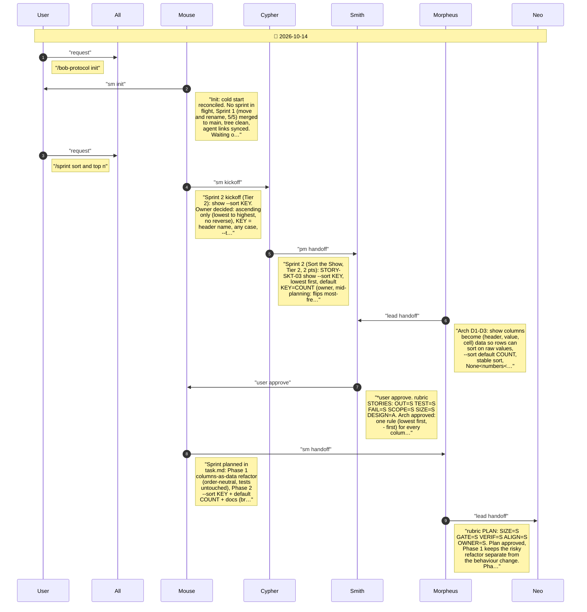
```mermaid
%%{init: {"sequence": {"messageFontSize": 14, "noteFontSize": 18, "actorFontSize": 14}}}%%
sequenceDiagram
    autonumber
    participant User
    participant All
    participant Mouse
    participant Cypher
    participant Smith
    participant Morpheus
    participant Neo
    Note over User,Neo: 📅 2026-10-14
    User->>All: "request"
    Note right of User: "/bob-protocol init"
    Mouse->>User: "sm init"
    Note right of Mouse: "Init: cold start<br/>reconciled. No sprint in<br/>flight, Sprint 1 (move<br/>and rename, 5/5) merged<br/>to main, tree clean,<br/>agent links synced.<br/>Waiting o…"
    User->>All: "request"
    Note right of User: "/sprint sort and top n"
    Mouse->>Cypher: "sm kickoff"
    Note right of Mouse: "Sprint 2 kickoff (Tier<br/>2): show --sort KEY.<br/>Owner decided: ascending<br/>only (lowest to highest,<br/>no reverse), KEY =<br/>header name, any case,<br/>--t…"
    Cypher->>Smith: "pm handoff"
    Note right of Cypher: "Sprint 2 (Sort the Show,<br/>Tier 2, 2 pts): STORY-<br/>SKT-03 show --sort KEY,<br/>lowest first, default<br/>KEY=COUNT (owner, mid-<br/>planning: flips most-<br/>fre…"
    Morpheus->>Smith: "lead handoff"
    Note right of Morpheus: "Arch D1-D3: show columns<br/>become (header, value,<br/>cell) data so rows can<br/>sort on raw values,<br/>--sort default COUNT,<br/>stable sort,<br/>None<numbers<…"
    Smith->>Mouse: "user approve"
    Note right of Smith: "*user approve. rubric<br/>STORIES: OUT=S TEST=S<br/>FAIL=S SCOPE=S SIZE=S<br/>DESIGN=A. Arch approved:<br/>one rule (lowest first,<br/>- first) for every<br/>colum…"
    Mouse->>Morpheus: "sm handoff"
    Note right of Mouse: "Sprint planned in<br/>task.md: Phase 1<br/>columns-as-data refactor<br/>(order-neutral, tests<br/>untouched), Phase 2<br/>--sort KEY + default<br/>COUNT + docs (br…"
    Morpheus->>Neo: "lead handoff"
    Note right of Morpheus: "rubric PLAN: SIZE=S<br/>GATE=S VERIF=S ALIGN=S<br/>OWNER=S. Plan approved,<br/>Phase 1 keeps the risky<br/>refactor separate from<br/>the behaviour change.<br/>Pha…"
```

---

## Phase 1

Columns as data: refactor show to one (header, value, cell) list, table unchanged

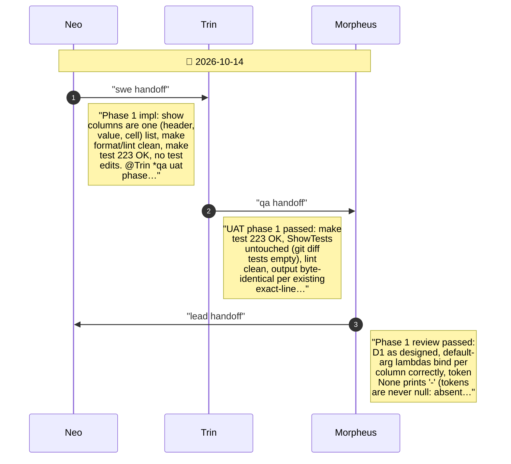
```mermaid
%%{init: {"sequence": {"messageFontSize": 14, "noteFontSize": 18, "actorFontSize": 14}}}%%
sequenceDiagram
    autonumber
    participant Neo
    participant Trin
    participant Morpheus
    Note over Neo,Morpheus: 📅 2026-10-14
    Neo->>Trin: "swe handoff"
    Note right of Neo: "Phase 1 impl: show<br/>columns are one (header,<br/>value, cell) list, make<br/>format/lint clean, make<br/>test 223 OK, no test<br/>edits. @Trin *qa uat<br/>phase…"
    Trin->>Morpheus: "qa handoff"
    Note right of Trin: "UAT phase 1 passed: make<br/>test 223 OK, ShowTests<br/>untouched (git diff<br/>tests empty), lint<br/>clean, output byte-<br/>identical per existing<br/>exact-line…"
    Morpheus->>Neo: "lead handoff"
    Note right of Morpheus: "Phase 1 review passed:<br/>D1 as designed, default-<br/>arg lambdas bind per<br/>column correctly, token<br/>None prints '-' (tokens<br/>are never null: absent…"
```

---

## Phase 2

--sort KEY, default COUNT (lowest first), help and README

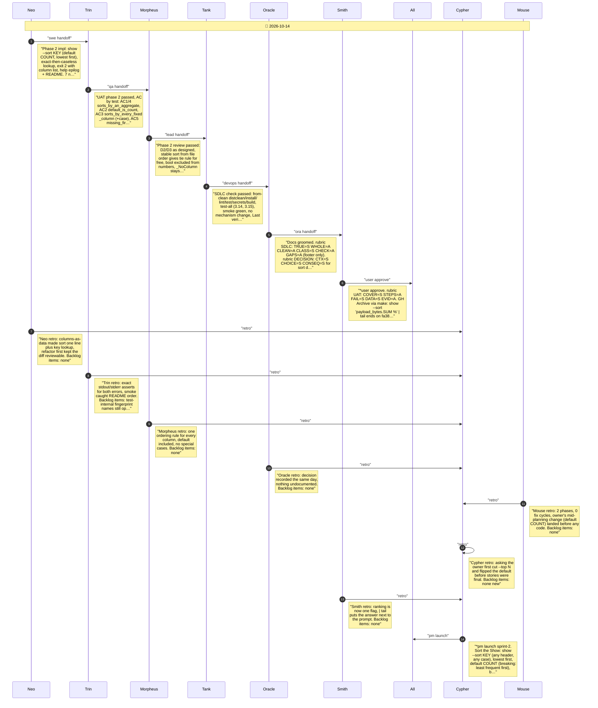
```mermaid
%%{init: {"sequence": {"messageFontSize": 14, "noteFontSize": 18, "actorFontSize": 14}}}%%
sequenceDiagram
    autonumber
    participant Neo
    participant Trin
    participant Morpheus
    participant Tank
    participant Oracle
    participant Smith
    participant All
    participant Cypher
    participant Mouse
    Note over Neo,Mouse: 📅 2026-10-14
    Neo->>Trin: "swe handoff"
    Note right of Neo: "Phase 2 impl: show<br/>--sort KEY (default<br/>COUNT, lowest first),<br/>exact-then-caseless<br/>lookup, exit 2 with<br/>column list, help epilog<br/>+ README. 7 n…"
    Trin->>Morpheus: "qa handoff"
    Note right of Trin: "UAT phase 2 passed, AC<br/>by test: AC1/4<br/>sorts_by_an_aggregate,<br/>AC2 default_is_count,<br/>AC3 sorts_by_every_fixed<br/>_column (+case), AC5<br/>missing_fir…"
    Morpheus->>Tank: "lead handoff"
    Note right of Morpheus: "Phase 2 review passed:<br/>D2/D3 as designed,<br/>stable sort from file<br/>order gives tie rule for<br/>free, bool excluded from<br/>numbers, _NoColumn<br/>stays…"
    Tank->>Oracle: "devops handoff"
    Note right of Tank: "SDLC check passed: from-<br/>clean distclean/install/<br/>lint/test/secrets/build,<br/>test-all (3.14, 3.15),<br/>smoke green, no<br/>mechanism change, Last<br/>veri…"
    Oracle->>Smith: "ora handoff"
    Note right of Oracle: "Docs groomed. rubric<br/>SDLC: TRUE=S WHOLE=A<br/>CLEAN=A CLASS=S CHECK=A<br/>GAPS=A (footer only).<br/>rubric DECISION: CTX=S<br/>CHOICE=S CONSEQ=S for<br/>sort d…"
    Smith->>All: "user approve"
    Note right of Smith: "*user approve. rubric<br/>UAT: COVER=S STEPS=A<br/>FAIL=S DATA=S EVID=A. GH<br/>Archive via make: show<br/>--sort<br/>'payload_bytes.SUM %' |<br/>tail ends on fa38…"
    Neo->>Cypher: "retro"
    Note right of Neo: "Neo retro: columns-as-<br/>data made sort one line<br/>plus key lookup,<br/>refactor first kept the<br/>diff reviewable. Backlog<br/>items: none"
    Trin->>Cypher: "retro"
    Note right of Trin: "Trin retro: exact<br/>stdout/stderr asserts<br/>for both errors, smoke<br/>caught README order.<br/>Backlog items: test-<br/>internal fingerprint<br/>names still op…"
    Morpheus->>Cypher: "retro"
    Note right of Morpheus: "Morpheus retro: one<br/>ordering rule for every<br/>column, default<br/>included, no special<br/>cases. Backlog items:<br/>none"
    Oracle->>Cypher: "retro"
    Note right of Oracle: "Oracle retro: decision<br/>recorded the same day,<br/>nothing undocumented.<br/>Backlog items: none"
    Mouse->>Cypher: "retro"
    Note right of Mouse: "Mouse retro: 2 phases, 0<br/>fix cycles, owner's mid-<br/>planning change (default<br/>COUNT) landed before any<br/>code. Backlog items:<br/>none"
    Cypher->>Cypher: "retro"
    Note right of Cypher: "Cypher retro: asking the<br/>owner first cut --top N<br/>and flipped the default<br/>before stories were<br/>final. Backlog items:<br/>none new"
    Smith->>Cypher: "retro"
    Note right of Smith: "Smith retro: ranking is<br/>now one flag, | tail<br/>puts the answer next to<br/>the prompt. Backlog<br/>items: none"
    Cypher->>All: "pm launch"
    Note right of Cypher: "*pm launch sprint-2.<br/>Sort the Show: show<br/>--sort KEY (any header,<br/>any case), lowest first,<br/>default COUNT (breaking:<br/>least frequent first),<br/>b…"
```

---

# CHAT_SPRINT_3 — Sprint Archive

## Summary

Sprint 3, Faster Merge (Tier 2, 5 pts). Owner: tune merge on the GH Archive hour with a profiler via make, stdlib cProfile, best effort KISS. Phase 0 (Tank): make profile (wall time, sketch hash, cProfile top 25); baseline 106.35 s. Phase 1: plain JSONPaths walk dicts (tested against python-jsonpath): 54.48 s. Phase 2: select once per event for sketch and run file; dropping deepcopy broke the copy contract, revised to one JSON-specific copy per event: 40.83 s. Hash unchanged throughout. Lesson on defensive copies. No release.

---

## Planning

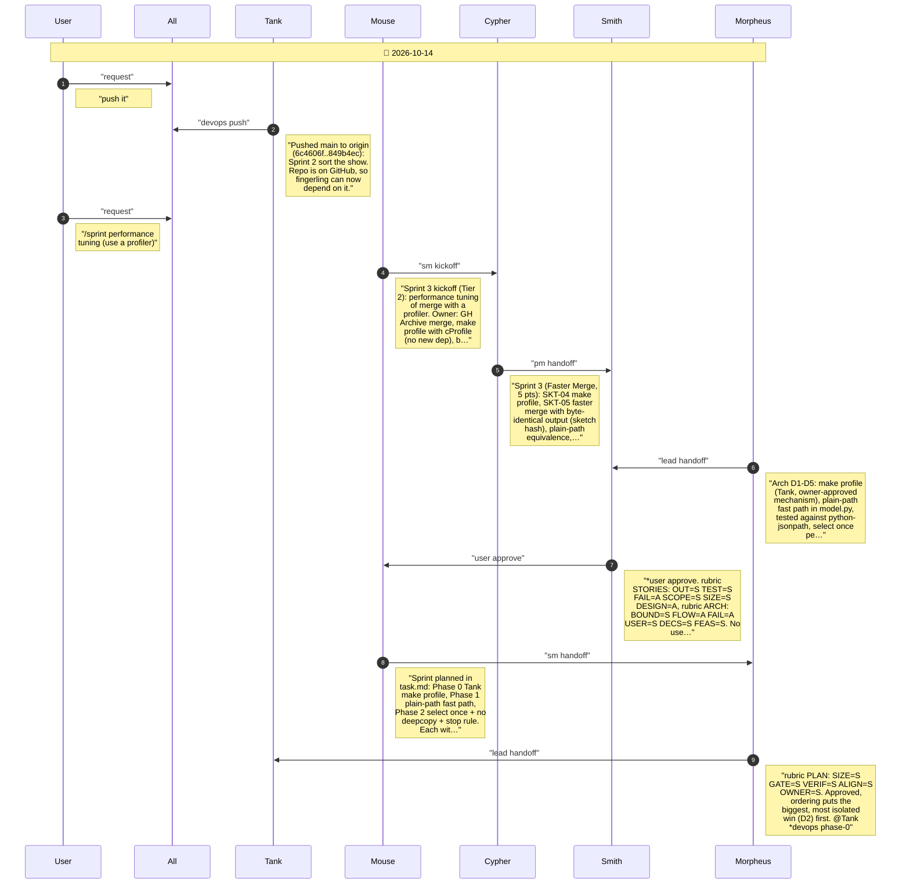
```mermaid
%%{init: {"sequence": {"messageFontSize": 14, "noteFontSize": 18, "actorFontSize": 14}}}%%
sequenceDiagram
    autonumber
    participant User
    participant All
    participant Tank
    participant Mouse
    participant Cypher
    participant Smith
    participant Morpheus
    Note over User,Morpheus: 📅 2026-10-14
    User->>All: "request"
    Note right of User: "push it"
    Tank->>All: "devops push"
    Note right of Tank: "Pushed main to origin<br/>(6c4606f..849b4ec):<br/>Sprint 2 sort the show.<br/>Repo is on GitHub, so<br/>fingerling can now<br/>depend on it."
    User->>All: "request"
    Note right of User: "/sprint performance<br/>tuning (use a profiler)"
    Mouse->>Cypher: "sm kickoff"
    Note right of Mouse: "Sprint 3 kickoff (Tier<br/>2): performance tuning<br/>of merge with a<br/>profiler. Owner: GH<br/>Archive merge, make<br/>profile with cProfile<br/>(no new dep), b…"
    Cypher->>Smith: "pm handoff"
    Note right of Cypher: "Sprint 3 (Faster Merge,<br/>5 pts): SKT-04 make<br/>profile, SKT-05 faster<br/>merge with byte-<br/>identical output (sketch<br/>hash), plain-path<br/>equivalence,…"
    Morpheus->>Smith: "lead handoff"
    Note right of Morpheus: "Arch D1-D5: make profile<br/>(Tank, owner-approved<br/>mechanism), plain-path<br/>fast path in model.py,<br/>tested against python-<br/>jsonpath, select once<br/>pe…"
    Smith->>Mouse: "user approve"
    Note right of Smith: "*user approve. rubric<br/>STORIES: OUT=S TEST=S<br/>FAIL=A SCOPE=S SIZE=S<br/>DESIGN=A, rubric ARCH:<br/>BOUND=S FLOW=A FAIL=A<br/>USER=S DECS=S FEAS=S. No<br/>use…"
    Mouse->>Morpheus: "sm handoff"
    Note right of Mouse: "Sprint planned in<br/>task.md: Phase 0 Tank<br/>make profile, Phase 1<br/>plain-path fast path,<br/>Phase 2 select once + no<br/>deepcopy + stop rule.<br/>Each wit…"
    Morpheus->>Tank: "lead handoff"
    Note right of Morpheus: "rubric PLAN: SIZE=S<br/>GATE=S VERIF=S ALIGN=S<br/>OWNER=S. Approved,<br/>ordering puts the<br/>biggest, most isolated<br/>win (D2) first. @Tank<br/>*devops phase-0"
```

---

## Phase 0

make profile: time, hash and cProfile the GH Archive merge

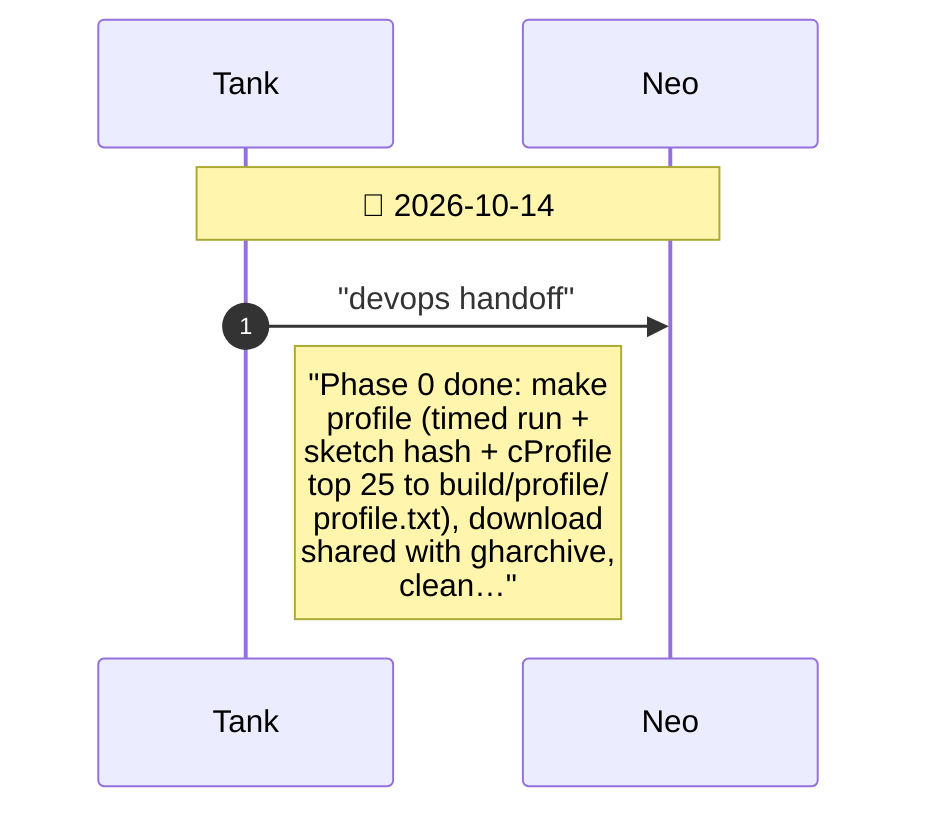
```mermaid
%%{init: {"sequence": {"messageFontSize": 14, "noteFontSize": 18, "actorFontSize": 14}}}%%
sequenceDiagram
    autonumber
    participant Tank
    participant Neo
    Note over Tank,Neo: 📅 2026-10-14
    Tank->>Neo: "devops handoff"
    Note right of Tank: "Phase 0 done: make<br/>profile (timed run +<br/>sketch hash + cProfile<br/>top 25 to build/profile/<br/>profile.txt), download<br/>shared with gharchive,<br/>clean…"
```

---

## Phase 1

Plain-path fast path in model.py, tested against python-jsonpath

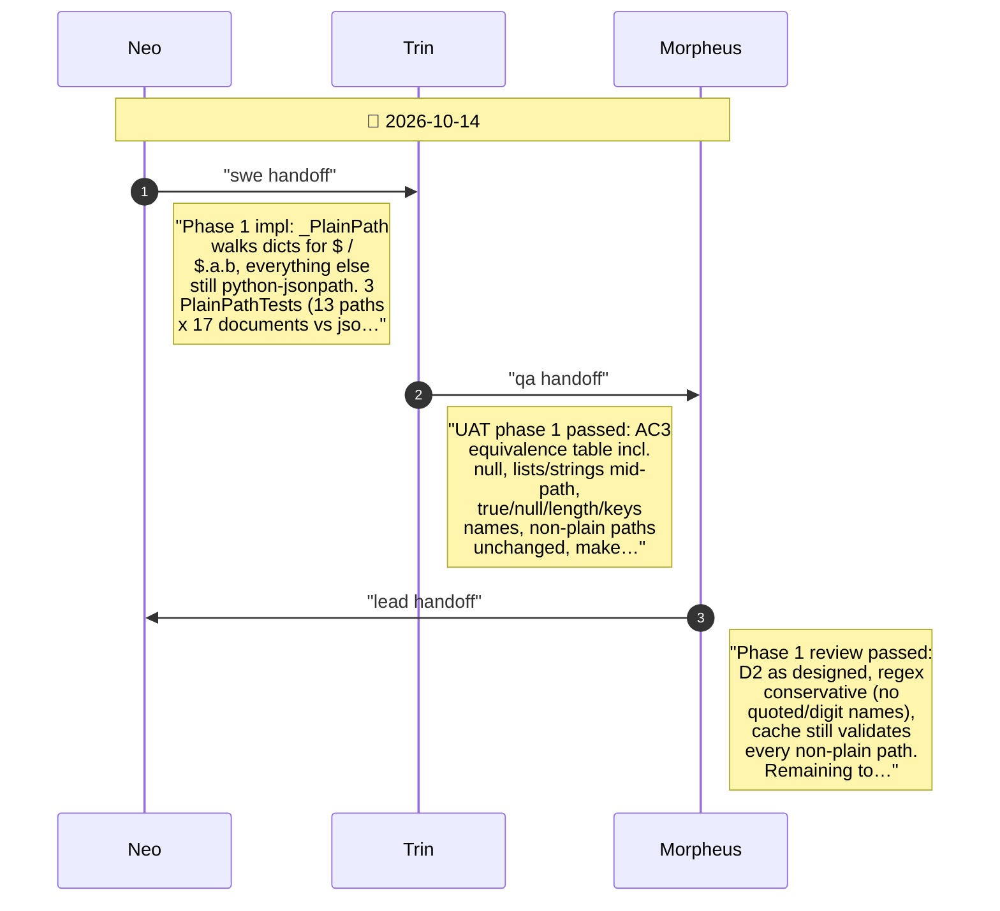
```mermaid
%%{init: {"sequence": {"messageFontSize": 14, "noteFontSize": 18, "actorFontSize": 14}}}%%
sequenceDiagram
    autonumber
    participant Neo
    participant Trin
    participant Morpheus
    Note over Neo,Morpheus: 📅 2026-10-14
    Neo->>Trin: "swe handoff"
    Note right of Neo: "Phase 1 impl: _PlainPath<br/>walks dicts for $ /<br/>$.a.b, everything else<br/>still python-jsonpath. 3<br/>PlainPathTests (13 paths<br/>x 17 documents vs jso…"
    Trin->>Morpheus: "qa handoff"
    Note right of Trin: "UAT phase 1 passed: AC3<br/>equivalence table incl.<br/>null, lists/strings mid-<br/>path,<br/>true/null/length/keys<br/>names, non-plain paths<br/>unchanged, make…"
    Morpheus->>Neo: "lead handoff"
    Note right of Morpheus: "Phase 1 review passed:<br/>D2 as designed, regex<br/>conservative (no<br/>quoted/digit names),<br/>cache still validates<br/>every non-plain path.<br/>Remaining to…"
```

---

## Phase 2

Select once per event, FIRST/LAST without deepcopy, alias-free dump

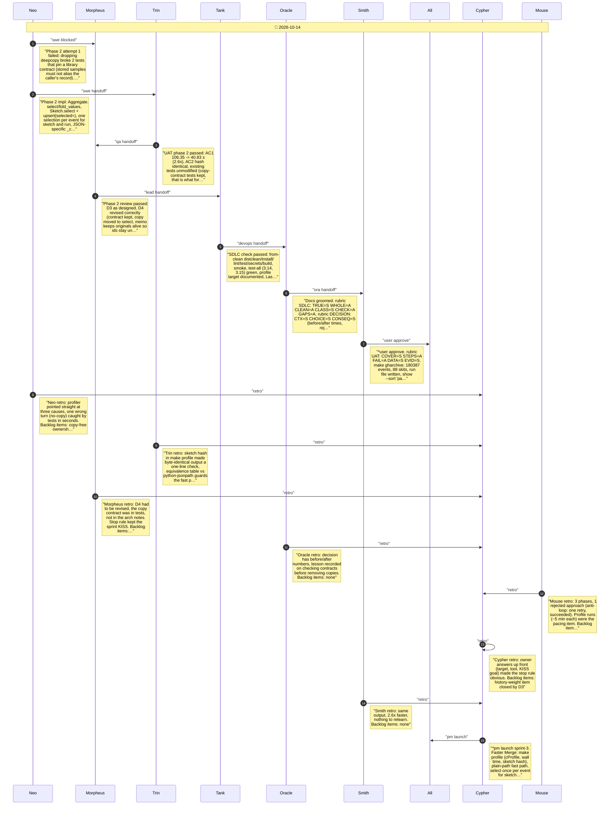
```mermaid
%%{init: {"sequence": {"messageFontSize": 14, "noteFontSize": 18, "actorFontSize": 14}}}%%
sequenceDiagram
    autonumber
    participant Neo
    participant Morpheus
    participant Trin
    participant Tank
    participant Oracle
    participant Smith
    participant All
    participant Cypher
    participant Mouse
    Note over Neo,Mouse: 📅 2026-10-14
    Neo->>Morpheus: "swe blocked"
    Note right of Neo: "Phase 2 attempt 1<br/>failed: dropping<br/>deepcopy broke 2 tests<br/>that pin a library<br/>contract (stored samples<br/>must not alias the<br/>caller's record).…"
    Neo->>Trin: "swe handoff"
    Note right of Neo: "Phase 2 impl: Aggregate.<br/>select/fold_values,<br/>Sketch.select +<br/>upsert(selected=), one<br/>selection per event for<br/>sketch and run, JSON-<br/>specific _c…"
    Trin->>Morpheus: "qa handoff"
    Note right of Trin: "UAT phase 2 passed: AC1<br/>106.35 -> 40.83 s<br/>(2.6x), AC2 hash<br/>identical, existing<br/>tests unmodified (copy-<br/>contract tests kept,<br/>that is what for…"
    Morpheus->>Tank: "lead handoff"
    Note right of Morpheus: "Phase 2 review passed:<br/>D3 as designed, D4<br/>revised correctly<br/>(contract kept, copy<br/>moved to select, memo<br/>keeps originals alive so<br/>ids stay un…"
    Tank->>Oracle: "devops handoff"
    Note right of Tank: "SDLC check passed: from-<br/>clean distclean/install/<br/>lint/test/secrets/build,<br/>smoke, test-all (3.14,<br/>3.15) green, profile<br/>target documented, Las…"
    Oracle->>Smith: "ora handoff"
    Note right of Oracle: "Docs groomed. rubric<br/>SDLC: TRUE=S WHOLE=A<br/>CLEAN=A CLASS=S CHECK=A<br/>GAPS=A. rubric DECISION:<br/>CTX=S CHOICE=S CONSEQ=S<br/>(before/after times,<br/>rej…"
    Smith->>All: "user approve"
    Note right of Smith: "*user approve. rubric<br/>UAT: COVER=S STEPS=A<br/>FAIL=A DATA=S EVID=S.<br/>make gharchive: 180387<br/>events, 88 skits, run<br/>file written, show<br/>--sort 'pa…"
    Neo->>Cypher: "retro"
    Note right of Neo: "Neo retro: profiler<br/>pointed straight at<br/>three causes, one wrong<br/>turn (no-copy) caught by<br/>tests in seconds.<br/>Backlog items: copy-free<br/>ownersh…"
    Trin->>Cypher: "retro"
    Note right of Trin: "Trin retro: sketch hash<br/>in make profile made<br/>byte-identical output a<br/>one-line check,<br/>equivalence table vs<br/>python-jsonpath guards<br/>the fast p…"
    Morpheus->>Cypher: "retro"
    Note right of Morpheus: "Morpheus retro: D4 had<br/>to be revised, the copy<br/>contract was in tests,<br/>not in the arch notes.<br/>Stop rule kept the<br/>sprint KISS. Backlog<br/>items:…"
    Oracle->>Cypher: "retro"
    Note right of Oracle: "Oracle retro: decision<br/>has before/after<br/>numbers, lesson recorded<br/>on checking contracts<br/>before removing copies.<br/>Backlog items: none"
    Mouse->>Cypher: "retro"
    Note right of Mouse: "Mouse retro: 3 phases, 1<br/>rejected approach (anti-<br/>loop: one retry,<br/>succeeded). Profile runs<br/>(~5 min each) were the<br/>pacing item. Backlog<br/>item…"
    Cypher->>Cypher: "retro"
    Note right of Cypher: "Cypher retro: owner<br/>answers up front<br/>(target, tool, KISS<br/>goal) made the stop rule<br/>obvious. Backlog items:<br/>history-weight item<br/>closed by D3"
    Smith->>Cypher: "retro"
    Note right of Smith: "Smith retro: same<br/>output, 2.6x faster,<br/>nothing to relearn.<br/>Backlog items: none"
    Cypher->>All: "pm launch"
    Note right of Cypher: "*pm launch sprint-3.<br/>Faster Merge: make<br/>profile (cProfile, wall<br/>time, sketch hash),<br/>plain-path fast path,<br/>select once per event<br/>for sketch…"
```

---

# CHAT_SPRINT_4 — Sprint Archive

## Summary

Sprint 4, Parallel Merge (Tier 2, 5 pts). Preceded by the owner's review of Sprint 3: JSONPath via jsonpath-rfc9535, fold once then merge, no FIRST/LAST copies (32.88 s). Owner design: processes, -j N default all cores, any matching FIRST/LAST sample. Pool with per-batch merges (17-19 s) and per-line shared-memory ring (25.7 s) measured and dropped; final: long-lived workers, bounded task queue of byte batches, output queue (16.46 s). libyaml everywhere: 13.54 s on 4 cores, 29.55 s -j 1. No release.

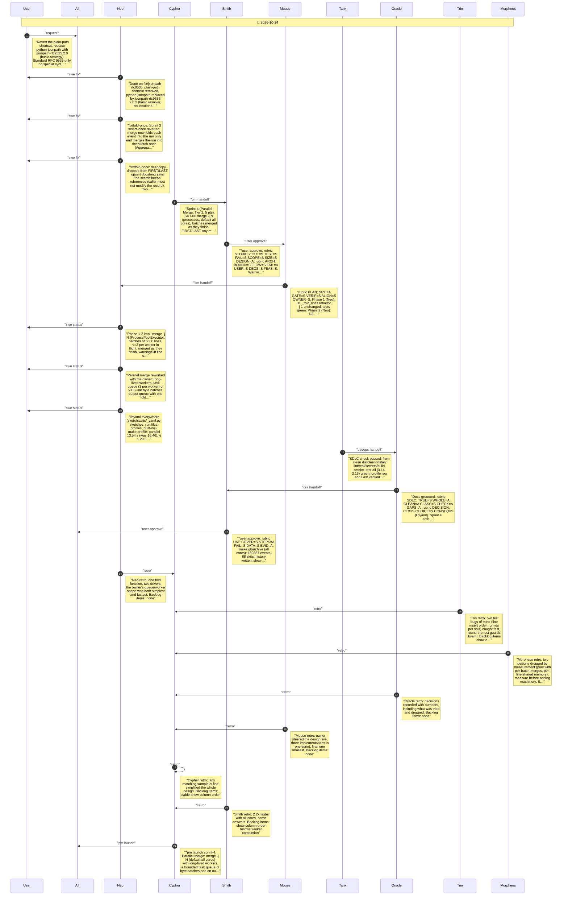
```mermaid
%%{init: {"sequence": {"messageFontSize": 14, "noteFontSize": 18, "actorFontSize": 14}}}%%
sequenceDiagram
    autonumber
    participant User
    participant All
    participant Neo
    participant Cypher
    participant Smith
    participant Mouse
    participant Tank
    participant Oracle
    participant Trin
    participant Morpheus
    Note over User,Morpheus: 📅 2026-10-14
    User->>All: "request"
    Note right of User: "Revert the plain-path<br/>shortcut, replace<br/>python-jsonpath with<br/>jsonpath-rfc9535 2.0<br/>(basic strategy).<br/>Standard RFC 9535 only,<br/>no special synt…"
    Neo->>User: "swe fix"
    Note right of Neo: "Done on fix/jsonpath-<br/>rfc9535: plain-path<br/>shortcut removed,<br/>python-jsonpath replaced<br/>by jsonpath-rfc9535<br/>2.0.2 (basic resolver,<br/>no locations…"
    Neo->>User: "swe fix"
    Note right of Neo: "fix/fold-once: Sprint 3<br/>select-once reverted,<br/>merge now folds each<br/>event into the run only<br/>and merges the run into<br/>the sketch once<br/>(Aggrega…"
    Neo->>User: "swe fix"
    Note right of Neo: "fix/fold-once: deepcopy<br/>dropped from FIRST/LAST,<br/>upsert docstring says<br/>the sketch keeps<br/>references (caller must<br/>not modify the record),<br/>two…"
    Cypher->>Smith: "pm handoff"
    Note right of Cypher: "Sprint 4 (Parallel<br/>Merge, Tier 2, 5 pts):<br/>SKT-06 merge -j N<br/>(processes, default all<br/>cores), batches merged<br/>as they finish,<br/>FIRST/LAST any m…"
    Smith->>Mouse: "user approve"
    Note right of Smith: "*user approve. rubric<br/>STORIES: OUT=S TEST=S<br/>FAIL=S SCOPE=S SIZE=S<br/>DESIGN=A, rubric ARCH:<br/>BOUND=S FLOW=S FAIL=A<br/>USER=S DECS=S FEAS=S.<br/>Warnin…"
    Mouse->>Neo: "sm handoff"
    Note right of Mouse: "rubric PLAN: SIZE=A<br/>GATE=S VERIF=S ALIGN=S<br/>OWNER=S. Phase 1 (Neo):<br/>D1 _fold_lines refactor,<br/>-j 1 unchanged, tests<br/>green. Phase 2 (Neo):<br/>D2-…"
    Neo->>User: "swe status"
    Note right of Neo: "Phase 1-2 impl: merge -j<br/>N (ProcessPoolExecutor,<br/>batches of 5000 lines,<br/><=2 per worker in<br/>flight, merged as they<br/>finish, warnings in line<br/>o…"
    Neo->>User: "swe status"
    Note right of Neo: "Parallel merge reworked<br/>with the owner: long-<br/>lived workers, task<br/>queue (3 per worker) of<br/>5000-line byte batches,<br/>output queue with one<br/>fold…"
    Neo->>User: "swe status"
    Note right of Neo: "libyaml everywhere<br/>(sketchtastic/_yaml.py:<br/>sketches, run files,<br/>profiles, built-ins).<br/>make profile: parallel<br/>13.54 s (was 16.46), -j<br/>1 29.5…"
    Tank->>Oracle: "devops handoff"
    Note right of Tank: "SDLC check passed: from-<br/>clean distclean/install/<br/>lint/test/secrets/build,<br/>smoke, test-all (3.14,<br/>3.15) green, profile row<br/>and Last verified…"
    Oracle->>Smith: "ora handoff"
    Note right of Oracle: "Docs groomed. rubric<br/>SDLC: TRUE=S WHOLE=A<br/>CLEAN=A CLASS=S CHECK=A<br/>GAPS=A. rubric DECISION:<br/>CTX=S CHOICE=S CONSEQ=S<br/>(libyaml). Sprint 4<br/>arch…"
    Smith->>All: "user approve"
    Note right of Smith: "*user approve. rubric<br/>UAT: COVER=S STEPS=A<br/>FAIL=S DATA=S EVID=A.<br/>make gharchive (all<br/>cores): 180387 events,<br/>88 skits, history<br/>written, show…"
    Neo->>Cypher: "retro"
    Note right of Neo: "Neo retro: one fold<br/>function, two drivers,<br/>the owner's queue/worker<br/>shape was both simplest<br/>and fastest. Backlog<br/>items: none"
    Trin->>Cypher: "retro"
    Note right of Trin: "Trin retro: two test<br/>bugs of mine (line<br/>insert order, run ids<br/>per split) caught fast,<br/>round-trip test guards<br/>libyaml. Backlog items:<br/>show c…"
    Morpheus->>Cypher: "retro"
    Note right of Morpheus: "Morpheus retro: two<br/>designs dropped by<br/>measurement (pool with<br/>per-batch merges, per-<br/>line shared memory),<br/>measure before adding<br/>machinery. B…"
    Oracle->>Cypher: "retro"
    Note right of Oracle: "Oracle retro: decisions<br/>recorded with numbers,<br/>including what was tried<br/>and dropped. Backlog<br/>items: none"
    Mouse->>Cypher: "retro"
    Note right of Mouse: "Mouse retro: owner<br/>steered the design live,<br/>three implementations in<br/>one sprint, final one<br/>smallest. Backlog items:<br/>none"
    Cypher->>Cypher: "retro"
    Note right of Cypher: "Cypher retro: 'any<br/>matching sample is fine'<br/>simplified the whole<br/>design. Backlog items:<br/>stable show column order"
    Smith->>Cypher: "retro"
    Note right of Smith: "Smith retro: 2.2x faster<br/>with all cores, same<br/>answers. Backlog items:<br/>show column order<br/>follows worker<br/>completion"
    Cypher->>All: "pm launch"
    Note right of Cypher: "*pm launch sprint-4.<br/>Parallel Merge: merge -j<br/>N (default all cores)<br/>with long-lived workers,<br/>a bounded task queue of<br/>byte batches and an ou…"
```

---

# CHAT_SPRINT_5 — Sprint Archive

## Summary

Sprint 5 delivered the repository-local Bluesky ASCII image-count demo. Bounded public capture and six enum dimensions produce representative image rows preserving the observed skit set. Live UAT: 4587 events, 821 images, 70 representatives. 267 tests pass on Python 3.14 and 3.15, with lint, wheel smoke/build, security scans and independent reviews. Owner-updated Bob Protocol skills included. No push or release.

---

## Planning

```mermaid
%%{init: {"sequence": {"messageFontSize": 14, "noteFontSize": 18, "actorFontSize": 14}}}%%
sequenceDiagram
    autonumber
    participant User
    participant All
    participant Tank
    participant Neo
    participant Mouse
    participant Morpheus
    participant Oracle
    participant Cypher
    participant Smith
    Note over User,Smith: 📅 2026-10-14
    User->>All: "request"
    Note right of User: "push sketch"
    Tank->>All: "devops push"
    Note right of Tank: "Pushed sketch-tastic<br/>main to origin (through<br/>bcabf73: post-Sprint 3<br/>fixes + Sprint 4).<br/>fingerling not touched<br/>(its pin bump to 849b4ec<br/>is s…"
    Note over User,Smith: 📅 2026-10-15
    Neo->>User: "swe fix"
    Note right of Neo: "Profile is the only<br/>source of key order:<br/>every skit starts with<br/>every aggregate in<br/>profile order at its<br/>initial state (0, [],<br/>AVG {null,0,0…"
    User->>All: "request"
    Note right of User: "Skit ids from token<br/>values in profile order<br/>(no keys), profile_id<br/>from field specs in<br/>profile order (v0: no<br/>compatibility)."
    Neo->>User: "swe fix"
    Note right of Neo: "Skit id = MD5 of JSON<br/>token values in profile<br/>order (no keys),<br/>profile_id = field specs<br/>in profile order. Golden<br/>ids, README quickstart<br/>(sm…"
    User->>All: "request"
    Note right of User: "push main"
    Tank->>All: "devops push"
    Note right of Tank: "Pushed main to origin<br/>(through 636243e:<br/>profile-order defaults,<br/>profile-ordered skit<br/>ids)."
    Mouse->>User: "handoff"
    Note right of Mouse: "Prepared for a context<br/>clear:<br/>Mouse/Neo/Morpheus state<br/>and task.md updated<br/>(pipeline, profile-order<br/>rules, measurements,<br/>owner rules, backl…"
    Note over User,Smith: 📅 2026-11-17
    User->>All: "request"
    Note right of User: "PyPI packaging with bob-<br/>protocol Init, corrected<br/>target is sketch-tastic,<br/>not fingerling."
    Tank->>All: "devops init"
    Note right of Tank: "Initialized Tank for<br/>sketch-tastic PyPI<br/>packaging. Why:<br/>packaging and trusted-<br/>publishing configuration<br/>already exist, reconcile<br/>their curre…"
    Tank->>Morpheus: "handoff"
    Note right of Tank: "Initialization complete<br/>in sketch-tastic.<br/>Existing Hatchling<br/>packaging,<br/>build/smoke/release-<br/>check targets and<br/>trusted-publishing<br/>workflow f…"
    User->>All: "request"
    Note right of User: "pypi publishing please"
    Tank->>All: "devops init"
    Note right of Tank: "Resuming PyPI publishing<br/>as Tank. Why: owner<br/>requested release,<br/>checking existing<br/>workflow, release<br/>version and external<br/>setup."
    Tank->>Tank: "handoff"
    Note right of Tank: "Release 0.2.0 build and<br/>tag-version check pass,<br/>GitHub pypi environment<br/>created. Awaiting owner<br/>pending publisher setup<br/>on PyPI. No tag pus…"
    Tank->>All: "devops resume"
    Note right of Tank: "Owner confirms PyPI<br/>publisher is pending,<br/>resuming authorized<br/>0.2.0 publication. Why:<br/>account setup<br/>prerequisite is<br/>complete."
    Tank->>Tank: "handoff"
    Note right of Tank: "Published sketch-tastic<br/>0.2.0: CI and trusted<br/>publishing succeeded<br/>(run 44212325102), PyPI<br/>wheel and sdist<br/>verified. No approval<br/>button nee…"
    Note over User,Smith: 📅 2026-11-18
    User->>All: "request"
    Note right of User: "prep for clear"
    Tank->>All: "devops resume"
    Note right of Tank: "Tank preparing cold-<br/>start handoff. Why:<br/>preserve completed PyPI<br/>release and outstanding<br/>local documentation<br/>changes before context<br/>clear."
    Tank->>Tank: "handoff"
    Note right of Tank: "Ready for context clear:<br/>0.2.0 published and CI<br/>green, Tank state has<br/>release URL, exact<br/>resume steps and<br/>uncommitted-file<br/>inventory. No sp…"
    User->>All: "request"
    Note right of User: "commit docs too please"
    Tank->>All: "devops resume"
    Note right of Tank: "Tank preparing<br/>documentation commit.<br/>Why: owner requested<br/>saving release records<br/>and clear-session<br/>handoff in git."
    Tank->>Tank: "handoff"
    Note right of Tank: "Release docs reviewed<br/>and ready to commit with<br/>saved cold-start state.<br/>Why: preserve successful<br/>0.2.0 publication, no<br/>package changes or te…"
    Note over User,Smith: 📅 2026-11-19
    User->>All: "request"
    Note right of User: "Assess HDFS for minimal<br/>regression test-data<br/>selection, informed by<br/>owner experience with<br/>electronic trading order<br/>types and parameters."
    Oracle->>All: "ora ask"
    Note right of Oracle: "Oracle initialized for<br/>HDFS suitability<br/>research. Why: determine<br/>coverage units, source-<br/>informed fields and<br/>whether recorded logs<br/>can suppo…"
    Oracle->>All: "ora resume"
    Note right of Oracle: "Owner requested<br/>rereading docs after<br/>research drift. Why:<br/>ground dataset<br/>assessment in existing p<br/>rofile/token/skit/sample<br/>behavior, not rep…"
    Oracle->>Oracle: "handoff"
    Note right of Oracle: "Docs reread: profiles<br/>collapse attribute<br/>values into token<br/>combinations, each skit<br/>already stores original-<br/>row samples plus<br/>counts/aggregat…"
    User->>All: "request"
    Note right of User: "Create Bluesky image-<br/>count visualization,<br/>sketch must capture<br/>observed meaningful<br/>variants of the<br/>visualization attributes<br/>and retain sampl…"
    Oracle->>Cypher: "handoff"
    Note right of Oracle: "Research complete:<br/>canonical image/gallery<br/>schemas found in<br/>bluesky-social/bsky.<br/>Why: shared attributes<br/>must cover actual image<br/>forms. @Cyp…"
    Cypher->>All: "pm init"
    Note right of Cypher: "Cypher initialized for<br/>Sprint 5. Why: define a<br/>reproducible image-count<br/>app with a sketch<br/>profile covering every<br/>displayed dimension."
    Cypher->>Smith: "handoff"
    Note right of Cypher: "Stories ready: SKT-08<br/>capture/sketch and<br/>SKT-09 image explorer.<br/>Why: define count<br/>semantics and shared<br/>dimensions before<br/>implementation. @S…"
    Smith->>All: "user init"
    Note right of Smith: "Smith initialized:<br/>reviewed Sprint 5<br/>stories. Why: verify<br/>capture counts, observed<br/>variants, original<br/>samples and failure<br/>behavior align wi…"
    Smith->>Morpheus: "user approve"
    Note right of Smith: "*user approve Gate 1.<br/>rubric STORIES: OUT=S<br/>TEST=S FAIL=A SCOPE=S<br/>SIZE=A DESIGN=A. Why:<br/>measurable app behavior<br/>and explicit observed-<br/>data…"
    Morpheus->>All: "lead init"
    Note right of Morpheus: "Morpheus initialized for<br/>Sprint 5 architecture.<br/>Why: use existing<br/>Sketch/Profile APIs and<br/>derive UI dimensions<br/>from the profile."
    Morpheus->>Smith: "handoff"
    Note right of Morpheus: "Architecture ready, new<br/>make targets and<br/>optional capture<br/>dependency need Tank<br/>Phase 0. Why: retain<br/>existing sketch<br/>mechanism and one dimen…"
    Smith->>All: "user init"
    Note right of Smith: "Smith resumed Gate 2.<br/>Why: review actual count<br/>semantics and error<br/>states before<br/>implementation."
    Smith->>Mouse: "user approve"
    Note right of Smith: "*user approve Gate 2.<br/>rubric ARCH: BOUND=S<br/>FLOW=A FAIL=A USER=S<br/>DECS=A FEAS=A. Why:<br/>counts, variants and<br/>capture limits are<br/>explicit. @Mous…"
    Mouse->>All: "sm init"
    Note right of Mouse: "Mouse initialized for<br/>Sprint 5 plan. Why:<br/>split build setup, data<br/>pipeline and UI into<br/>bounded phases."
    Mouse->>Morpheus: "handoff"
    Note right of Mouse: "Sprint 5 tasks recorded<br/>in task.md. Why: bounded<br/>setup, pipeline and UI<br/>phases with explicit<br/>gates. @Morpheus *lead<br/>review sprint 5 plan."
    Morpheus->>Tank: "handoff"
    Note right of Morpheus: "Plan approved. rubric<br/>PLAN: SIZE=A GATE=A<br/>VERIF=A ALIGN=S OWNER=A.<br/>Why: phases map to<br/>approved outcomes. @Tank<br/>*devops bootstrap demo<br/>targe…"
    User->>All: "request"
    Note right of User: "Owner confirms local<br/>repository, enumerated<br/>values/branch<br/>distinctions, and ASCII<br/>terminal output. No web<br/>app."
    Tank->>All: "devops init"
    Note right of Tank: "Tank initialized. Why:<br/>owner simplified UI to<br/>ASCII, add only Python<br/>demo targets and<br/>optional WebSocket<br/>capture group."
```

---

## Phase 0

Phase 0: Python-only demo targets and optional capture tools. Why: owner explicitly requests ASCII, not web.

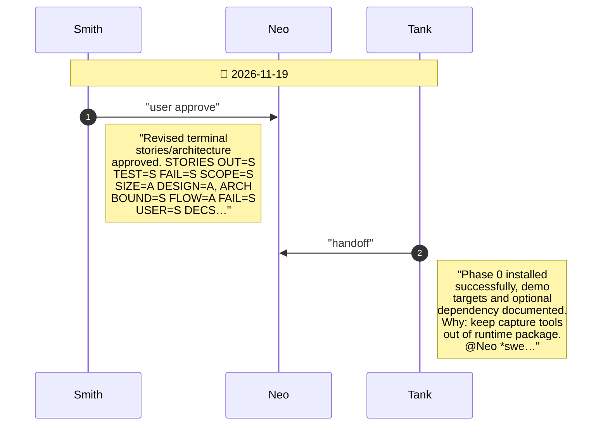
```mermaid
%%{init: {"sequence": {"messageFontSize": 14, "noteFontSize": 18, "actorFontSize": 14}}}%%
sequenceDiagram
    autonumber
    participant Smith
    participant Neo
    participant Tank
    Note over Smith,Tank: 📅 2026-11-19
    Smith->>Neo: "user approve"
    Note right of Smith: "Revised terminal<br/>stories/architecture<br/>approved. STORIES OUT=S<br/>TEST=S FAIL=S SCOPE=S<br/>SIZE=A DESIGN=A, ARCH<br/>BOUND=S FLOW=A FAIL=S<br/>USER=S DECS…"
    Tank->>Neo: "handoff"
    Note right of Tank: "Phase 0 installed<br/>successfully, demo<br/>targets and optional<br/>dependency documented.<br/>Why: keep capture tools<br/>out of runtime package.<br/>@Neo *swe…"
```

---

## Phase 1

Phase 1: capture, normalize, sketch and retain real image variants.

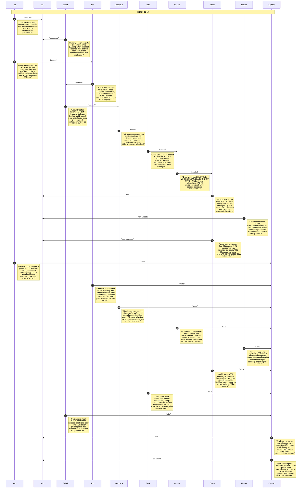
```mermaid
%%{init: {"sequence": {"messageFontSize": 14, "noteFontSize": 18, "actorFontSize": 14}}}%%
sequenceDiagram
    autonumber
    participant Neo
    participant All
    participant Switch
    participant Trin
    participant Morpheus
    participant Tank
    participant Oracle
    participant Smith
    participant Mouse
    participant Cypher
    Note over Neo,Cypher: 📅 2026-11-19
    Neo->>All: "swe init"
    Note right of Neo: "Neo initialized. Why:<br/>implement ASCII demo<br/>with enum-aware profile<br/>and tests for<br/>count/variant<br/>preservation."
    Switch->>All: "sec review"
    Note right of Switch: "Security design gate: No<br/>blocking findings<br/>(Switch). Why: bounded<br/>credential-free capture,<br/>fresh outputs and<br/>escaped terminal text,<br/>impleme…"
    Neo->>Trin: "handoff"
    Note right of Neo: "Implementation passed:<br/>267 tests, lint, real<br/>capture -> sketch -><br/>ASCII report. Why:<br/>validate unchanged core<br/>plus all new contracts.<br/>@Trin…"
    Trin->>Switch: "handoff"
    Note right of Trin: "UAT: 24 new tests plus<br/>full suite 267 pass,<br/>independent boundary<br/>tests cover enums,<br/>filters, retained<br/>events, malformed input<br/>and escaping.…"
    Switch->>Morpheus: "handoff"
    Note right of Switch: "Security gates<br/>design/phase 1: No<br/>blocking findings.<br/>Locked audit, secret<br/>scan and staged-hook<br/>proof passed,<br/>output/terminal fixes<br/>reviewed…"
    Morpheus->>Tank: "handoff"
    Note right of Morpheus: "All phases reviewed, no<br/>blocking findings. Why:<br/>identity, weighted<br/>counts and provenance<br/>match architecture.<br/>@Tank *devops sdlc-check"
    Tank->>Oracle: "handoff"
    Note right of Tank: "Clean SDLC check passed:<br/>267 tests on 3.14/3.15,<br/>lint, three wheel<br/>smokes, build and<br/>security scans. Why:<br/>verify reproducibility<br/>with optio…"
    Oracle->>Smith: "handoff"
    Note right of Oracle: "Docs groomed, SDLC TRUE/<br/>WHOLE/CLEAN/CLASS/CHECK/<br/>GAPS=PASS, decision<br/>rationale and ASCII<br/>guide consistent. Why:<br/>capture scope and<br/>representa…"
    Smith->>All: "init"
    Note right of Smith: "Smith initialized for<br/>live ASCII UAT. Why:<br/>clean gates passed,<br/>verify real capture<br/>counts, filtered reports<br/>and exported<br/>representatives th…"
    Mouse->>All: "sm update"
    Note right of Mouse: "Plan reconciliation:<br/>capture,<br/>normalization/export and<br/>ASCII report ran as one<br/>three-task phase with<br/>shared enums, all final<br/>code passed Tr…"
    Smith->>All: "user approve"
    Note right of Smith: "User testing passed:<br/>live 821 images -> 70<br/>representatives,<br/>retained IDs equal, AND<br/>filters and skt show<br/>work. UAT COVER/STEPS/FA<br/>IL/DATA/EV…"
    Neo->>Cypher: "retro"
    Note right of Neo: "Neo retro: one image row<br/>preserves correlations<br/>and original events,<br/>shared enums keep<br/>grouping/filtering<br/>consistent. Backlog:<br/>none. Why: a…"
    Trin->>Cypher: "retro"
    Note right of Trin: "Trin retro: independent<br/>enum boundary and<br/>adversarial input tests<br/>added value, 24 demo<br/>tests and 267 total<br/>pass. Backlog: rare live<br/>variant…"
    Morpheus->>Cypher: "retro"
    Note right of Morpheus: "Morpheus retro: existing<br/>sketch APIs suffice, no<br/>core changes. Backlog:<br/>none. Why: normalization<br/>owns image semantics and<br/>profile owns vari…"
    Oracle->>Cypher: "retro"
    Note right of Oracle: "Oracle retro: documented<br/>exact input/export<br/>distinction and coverage<br/>scope. Backlog: none.<br/>Why: representative rows<br/>use core merge, raw pos…"
    Mouse->>Cypher: "retro"
    Note right of Mouse: "Mouse retro: final<br/>pipeline/report shared<br/>one three-task phase,<br/>update board sooner when<br/>execution changes.<br/>Backlog: longer capture<br/>optiona…"
    Smith->>Cypher: "retro"
    Note right of Smith: "Smith retro: ASCII<br/>output makes counts,<br/>filters and missing enum<br/>values inspectable.<br/>Backlog: longer captures<br/>for rare variants. Why:<br/>obser…"
    Tank->>Cypher: "retro"
    Note right of Tank: "Tank retro: clean<br/>rebuild and optional<br/>dependency groups<br/>passed, release runtime<br/>unchanged. Backlog:<br/>none. Why: demo remains<br/>repository-loc…"
    Switch->>Cypher: "retro"
    Note right of Switch: "Switch retro: fresh-<br/>output reservation,<br/>escaped labels and exact<br/>domain validation<br/>protect public-data<br/>boundaries. Scans and<br/>staged hook pa…"
    Cypher->>All: "retro"
    Note right of Cypher: "Cypher retro: owner<br/>correction narrowed<br/>scope to ASCII image<br/>analysis and enum<br/>variants. 8/8 points<br/>accepted. Backlog:<br/>longer optional samp…"
    Cypher->>All: "pm launch"
    Note right of Cypher: "*pm launch Sprint 5.<br/>Complete: public Bluesky<br/>capture, enum<br/>sketch/export and ASCII<br/>counts. All gates<br/>passed, 821 images<br/>retain 70 observed…"
```

## Sprint close-out

- **Cypher**: \*pm launch Sprint 5. Complete: public Bluesky capture, enum sketch/export and ASCII counts. All gates passed, 821 images retain 70 observed…
